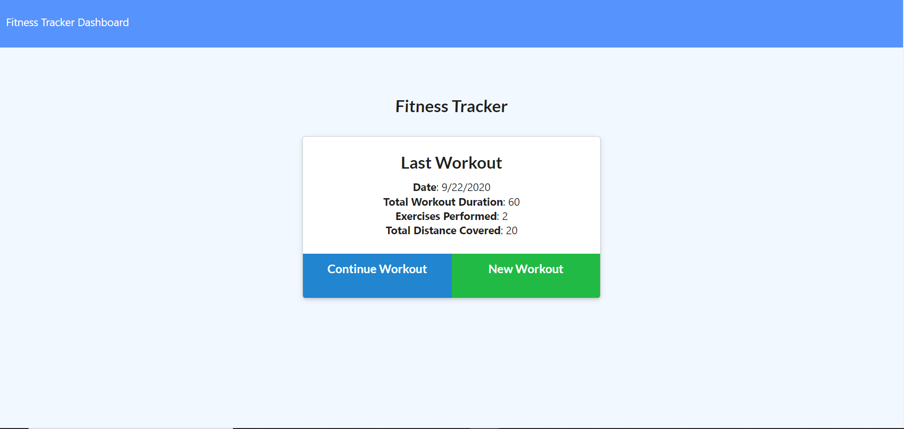
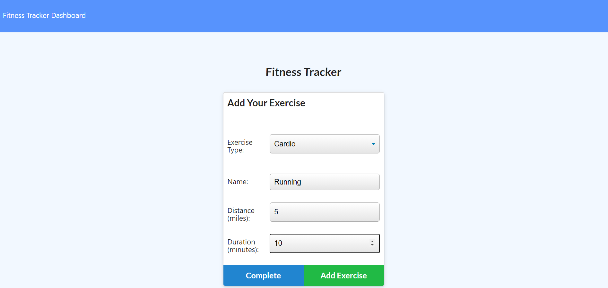
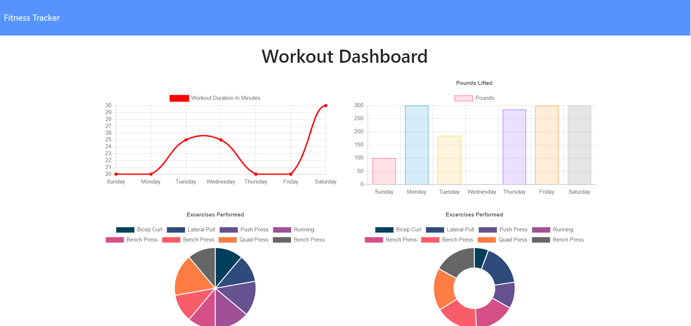

# Workout Tracker

## Description
This application uses Node.js, Express, MongoDB, Mongoose and Morgan as well as pre-developed front end files to create a workout tracker application that allows a user to track their workouts or create new ones. 

## Table of Contents

* [Installation](#installation)
* [Usage](#usage)
* [License](#license)
* [Badges](#badges)
* [Contributing](#contributing)
* [Tests](#tests)
* [Questions](#questions)

## Installation
To pre-populate database, type npm run seed from Node.js command line. Npm install will install the required dependencies from the package.json file. 

## Usage
Create new workouts by clicking the New Workout button, or continue where you left off by clicking the Continue Workout button. 

Enter you workout stats.

Check the Fitness Tracker Dashboard to display results.

## License
N/A

## Badges
N/A

## Contributing 
Feel free to contact me using the information in the Questions section.

## Tests
None

## Questions?
[jpanakkal22](https://github.com/jpanakkal22)

You can also contact me at josh_panakkal3122@hotmail.com

Heroku live webpage: https://secure-harbor-83749.herokuapp.com/
